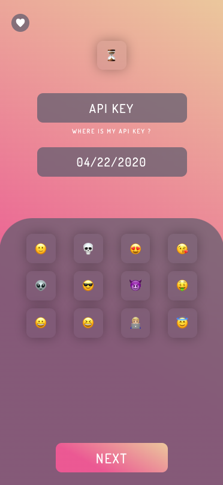

<h1 align="center">
  😎Desk Story👨🏼‍💻
</h1>
<h4 align="center">
  ▶️ Desk Story generates fancy page from your desktime stats ◀️
</h4>

  
  
  

<h5 align="center">
  🗣🆒 SHARE YOUR STATS ON YOUR SOCIAL MEDIA! 💃🏼🕺🏾
</h5>
